# CCP6124 OOPDS — Virtual Machine and Assembly Language Interpreter
**Tutorial Section:** TT9L &nbsp;&nbsp; **Group:** I &nbsp;&nbsp; **Term:** 2610

> 📌 **TODO before submission:** convert this file to PDF and rename to `TT9L_I.pdf`. Rename `practice.cpp` to `TT9L_I.cpp`. Place both (plus the `.mpeg` video) in a folder named `TT9L_I` and zip as `TT9L_I.zip`.

**Members:**
| Name | Student ID | Contribution |
|------|-----------|--------------|
| Adam | 252UC242PM | Register, GeneralRegister, FlagRegister, Memory, Stack, CPU (core architecture); integration of all members' work; RESET/PUSH/POP |
| Adeeb | 252UC242WZ | Instruction abstract base, custom Vector (`MyVector`), MOV, ADD, SUB, MUL, DIV, INC, DEC |
| Ammar | 253UC242Z8 | Custom Queue (`MyQueue`), LOAD, STORE, ROL, ROR, SHL, SHR, INPUT, DISPLAY, Runner |

---

## 1. Introduction

This report documents the design and implementation of a Virtual Machine (VM) and its Assembly Language Interpreter, built in C++ as required by the CCP6124 OOPDS assignment. The VM models a simplified CPU with 8 general-purpose registers (R0–R7), a 64-byte memory space, a status flag register, and a custom-built stack — all implemented using object-oriented principles (encapsulation, inheritance, polymorphism, composition, aggregation) and our own data structures (`MyVector`, `MyQueue`, `Stack` — no STL containers).

---

## 2. System Architecture

### 2.1 Overview

The system is organized into three layers:

1. **Core hardware model** — `Register`, `GeneralRegister`, `FlagRegister`, `Memory`, `Stack`, `CPU`.
2. **Instruction set** — abstract `Instruction` base class with polymorphic `execute()`, three intermediate abstract subclasses (`ArithmeticInstruction`, `IOInstruction`, `ShiftInstruction`), and 17 concrete instruction classes covering every opcode in the spec.
3. **Execution driver** — `Runner`, which reads a `.asm` program file into a custom `MyVector<string>` (one element per line), parses each line into an `Instruction*`, enqueues it into a custom `MyQueue<Instruction*>`, then dequeues and executes each one via the `CPU` in order.

### 2.2 Class Relationships

- **Composition:** `CPU` *owns* `Memory` as a plain value member — a `Memory` object has no existence outside of its `CPU`; it is created and destroyed with it.
- **Aggregation:** `CPU` *uses* a `FlagRegister` it does **not** own — `CPU`'s constructor takes a `FlagRegister&`, created and owned by whoever constructs the `CPU` (e.g. `Runner`). The `FlagRegister` can exist independently of any particular `CPU` and isn't destroyed when the `CPU` is. This is a structural distinction in the code, not just a description — `Memory` and `FlagRegister` are deliberately *not* both implemented the same way.
- **Inheritance:** `GeneralRegister` derives from `Register`. `ArithmeticInstruction`, `IOInstruction`, `ShiftInstruction` derive from the abstract `Instruction` base; all 17 concrete instruction classes derive from one of these three (or directly from `Instruction` for opcodes with no named category in the spec's class diagram, e.g. `MovInstruction`, `LoadInstruction`, `StoreInstruction`, `ResetInstruction`, `PushInstruction`, `PopInstruction`).
- **Polymorphism:** demonstrated in two separate places, both using a base `Instruction*`: (1) `Runner` stores parsed instructions in `MyQueue<Instruction*>` and calls `execute()` on each via the base pointer; (2) `demoPolymorphism()` independently builds a small program in `MyVector<Instruction*>` and dispatches through it the same way.

### 2.3 UML Class Diagram

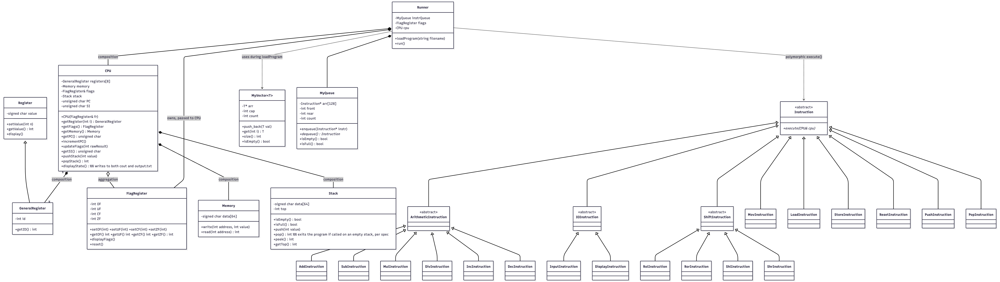

Mermaid source (kept for reference / re-rendering if needed):

```mermaid
classDiagram
    class Register {
        -signed char value
        +setValue(int n)
        +getValue() int
        +display()
    }
    class GeneralRegister {
        -int id
        +getID() int
    }
    Register <|-- GeneralRegister

    class FlagRegister {
        -int OF
        -int UF
        -int CF
        -int ZF
        +setOF(int) +setUF(int) +setCF(int) +setZF(int)
        +getOF() int +getUF() int +getCF() int +getZF() int
        +displayFlags()
        +reset()
    }

    class Memory {
        -signed char data[64]
        +write(int address, int value)
        +read(int address) int
    }

    class Stack {
        -signed char data[64]
        -int top
        +isEmpty() bool
        +isFull() bool
        +push(int value)
        +pop() int  %% exits the program if called on an empty stack, per spec
        +peek() int
        +getTop() int
    }

    class CPU {
        -GeneralRegister registers[8]
        -Memory memory
        -FlagRegister& flags
        -Stack stack
        -unsigned char PC
        -unsigned char SI
        +CPU(FlagRegister& fr)
        +getRegister(int i) GeneralRegister
        +getFlags() FlagRegister
        +getMemory() Memory
        +getPC() unsigned char
        +incrementPC()
        +updateFlags(int rawResult)
        +getSI() unsigned char
        +pushStack(int value)
        +popStack() int
        +displayState()  %% writes to both cout and output.txt
    }

    CPU *-- Memory : composition
    CPU o-- FlagRegister : aggregation
    CPU "1" *-- "8" GeneralRegister : composition
    CPU *-- Stack : composition

    class Instruction {
        <<abstract>>
        +execute(CPU& cpu)*
    }
    class ArithmeticInstruction { <<abstract>> }
    class IOInstruction { <<abstract>> }
    class ShiftInstruction { <<abstract>> }
    Instruction <|-- ArithmeticInstruction
    Instruction <|-- IOInstruction
    Instruction <|-- ShiftInstruction

    class AddInstruction
    class SubInstruction
    class MulInstruction
    class DivInstruction
    class IncInstruction
    class DecInstruction
    ArithmeticInstruction <|-- AddInstruction
    ArithmeticInstruction <|-- SubInstruction
    ArithmeticInstruction <|-- MulInstruction
    ArithmeticInstruction <|-- DivInstruction
    ArithmeticInstruction <|-- IncInstruction
    ArithmeticInstruction <|-- DecInstruction

    class RolInstruction
    class RorInstruction
    class ShlInstruction
    class ShrInstruction
    ShiftInstruction <|-- RolInstruction
    ShiftInstruction <|-- RorInstruction
    ShiftInstruction <|-- ShlInstruction
    ShiftInstruction <|-- ShrInstruction

    class InputInstruction
    class DisplayInstruction
    IOInstruction <|-- InputInstruction
    IOInstruction <|-- DisplayInstruction

    class MovInstruction
    class LoadInstruction
    class StoreInstruction
    class ResetInstruction
    class PushInstruction
    class PopInstruction
    Instruction <|-- MovInstruction
    Instruction <|-- LoadInstruction
    Instruction <|-- StoreInstruction
    Instruction <|-- ResetInstruction
    Instruction <|-- PushInstruction
    Instruction <|-- PopInstruction

    class MyVector~T~ {
        -T* arr
        -int cap
        -int count
        +push_back(T val)
        +get(int i) T
        +size() int
        +isEmpty() bool
    }

    class MyQueue {
        -Instruction* arr[128]
        -int front
        -int rear
        -int count
        +enqueue(Instruction* instr)
        +dequeue() Instruction*
        +isEmpty() bool
        +isFull() bool
    }

    class Runner {
        -MyQueue instrQueue
        -FlagRegister flags
        -CPU cpu
        +loadProgram(string filename)
        +run()
    }
    Runner *-- CPU : composition
    Runner *-- FlagRegister : owns, passed to CPU
    Runner *-- MyQueue
    Runner ..> MyVector~string~ : uses during loadProgram
    Runner ..> Instruction : polymorphic execute()
```

---

## 3. Algorithms

### 3.1 Fetch–Decode–Execute Loop (Runner)

`Runner::loadProgram(filename)` works in two stages, matching the spec's description of reading the file "into a dynamic array/vector of strings":
1. Reads the `.asm` file line by line via `ifstream`/`getline`, pushing each raw line into a `MyVector<string>`.
2. Iterates that vector; each line is passed to `parseLine()`, which strips comments (`;`) and blank lines, splits the opcode from its comma-separated operands, detects more than one instruction on a single line (exits with an error if found, per spec), and constructs the matching `Instruction*` subclass. Valid instructions are enqueued into `instrQueue` (a `MyQueue<Instruction*>`).

**Activity diagram — `loadProgram()`:**

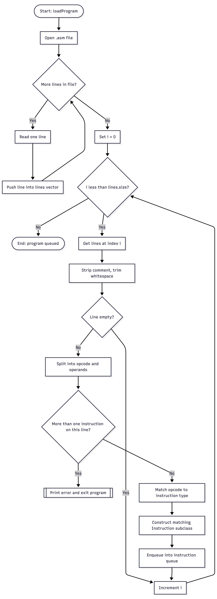

Mermaid source (kept for reference / re-rendering if needed):

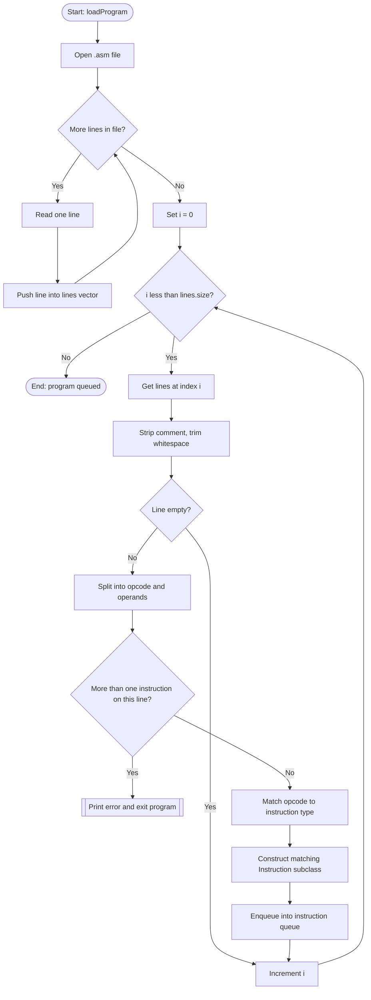

`Runner::run()` then dequeues and executes instructions in FIFO order until the queue is empty: `instr->execute(cpu)` (virtual dispatch — this is where polymorphism happens), then deletes the instruction. After the loop (or after every instruction, in `--step` mode), `cpu.displayState()` prints the VM state to both the screen and `output.txt`.

**Activity diagram — `run()`:**

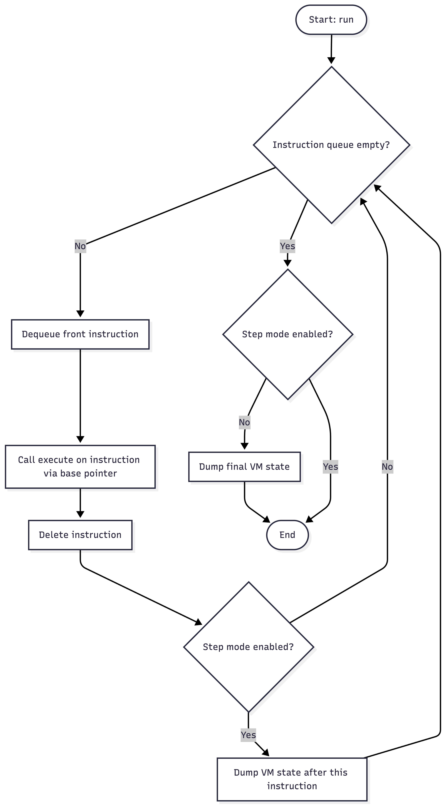

Mermaid source (kept for reference / re-rendering if needed):

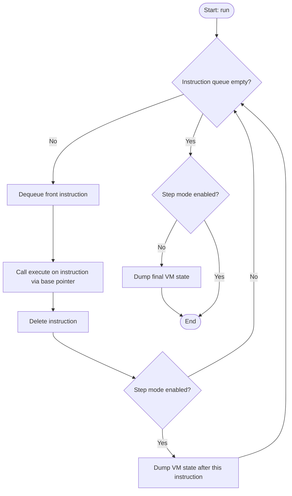

### 3.2 Flag Update Algorithm

Flags are computed from the **unclamped** result of an operation, before the result is clamped into the destination register. This ordering is essential — if the value were clamped first, overflow/underflow would never be detectable since the result would already be capped to ±127/-128.

```cpp
// CPU::updateFlags — Member 1: Adam
void updateFlags(int rawResult) {
    flags.setOF(rawResult > 127 ? 1 : 0);
    flags.setUF(rawResult < -128 ? 1 : 0);
    flags.setCF((rawResult > 127 || rawResult < -128) ? 1 : 0);
    flags.setZF(rawResult == 0 ? 1 : 0);
}
```

Every `Instruction::execute()` that changes a destination register's value calls this with the raw (unclamped) result, then calls `setValue()` on the register, which performs the actual clamping. Per spec section 3.10's general rule ("flags should be updated after each operation that changes the value of a destination register"), this applies broadly — not just to ADD/SUB/MUL/DIV/INC/DEC, but also MOV, LOAD, ROL/ROR/SHL/SHR, and POP (all of which write a new value into a register). `PUSH` does **not** update flags, since it doesn't change any register.

**Activity diagram — generic `Instruction::execute()` pattern (e.g. `AddInstruction`):**

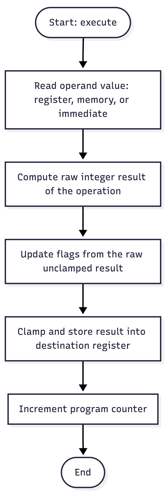

Mermaid source (kept for reference / re-rendering if needed):

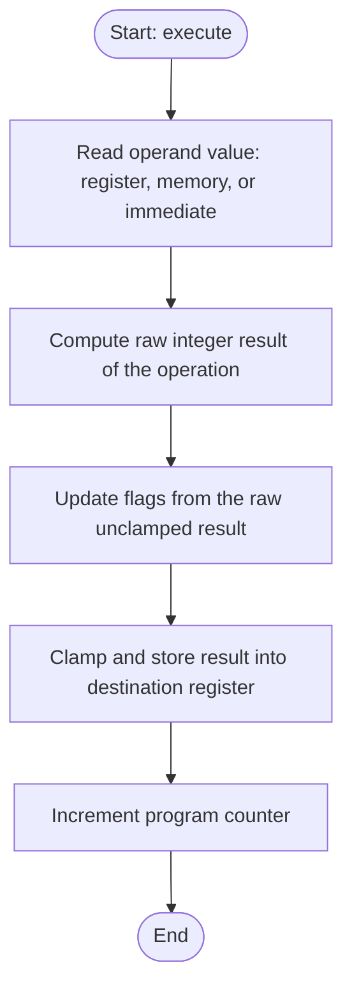

> 📌 **TODO:** capture a screenshot of a sample `ADD` operation that overflows R0 past 127, showing `OF=1` in the output.

### 3.3 Rotate/Shift bit semantics

`ROL`/`ROR`/`SHL`/`SHR` all operate on the register's **unsigned 8-bit byte pattern**, not its signed `int` value — shifting/rotating a negative signed value directly in C++ is either undefined behavior (left shift of a negative number) or sign-extends instead of zero-filling (right shift of a negative number), neither of which matches the spec's bit-diagram examples. Each instruction reads the register as `unsigned char`, performs the shift/rotate on that, then casts the result back to `signed char` before storing it. `ROL`/`ROR` use `(val << n) | (val >> (8-n))` (and the mirror for `ROR`) so no bits are lost; `SHL`/`SHR` zero-fill and force the result to 0 for `count >= 8`. Verified bit-exact against the spec's own worked examples (e.g. `10110011` SHL 1 → `01100110` = 102 decimal).

---

## 4. Assembly Language — Instruction Set & Example Programs

### 4.1 Supported Instructions

| Category | Instructions |
|----------|-------------|
| I/O | `INPUT Rd` (prompts with `?`), `DISPLAY Rd` |
| Move | `MOV Rd, imm` / `MOV Rd, Rs` / `MOV Rd, [Rs]` |
| Arithmetic | `ADD Rd, Rs`, `SUB Rd, Rs`, `MUL Rd, Rs`, `DIV Rd, Rs`, `INC Rd`, `DEC Rd` |
| Rotate | `ROL Rd, count`, `ROR Rd, count` |
| Shift | `SHL Rd, count`, `SHR Rd, count` |
| Memory | `LOAD Rd, [addr]` / `LOAD Rd, [Rs]`, `STORE Rd, addr` / `STORE Rs, [Rd]` |
| Flags | `RESET <OF\|UF\|CF\|ZF>` |
| Stack | `PUSH Rd`, `POP Rd` (popping an empty stack exits the program, per spec) |

All instructions are parsed from plain-text `.asm` files; `;` starts a comment, blank lines are ignored, and more than one instruction on a line is a fatal parse error.

### 4.2 Example Program 1 — Sum of 5 Values (`sum5.asm`)

```asm
; sum5.asm - reads 5 values and displays their sum
INPUT R0
INPUT R1
INPUT R2
INPUT R3
INPUT R4
ADD R0, R1
ADD R0, R2
ADD R0, R3
ADD R0, R4
DISPLAY R0
```
*Verified:* inputs 10, 20, 30, 40, 0 → R0 = **100**.

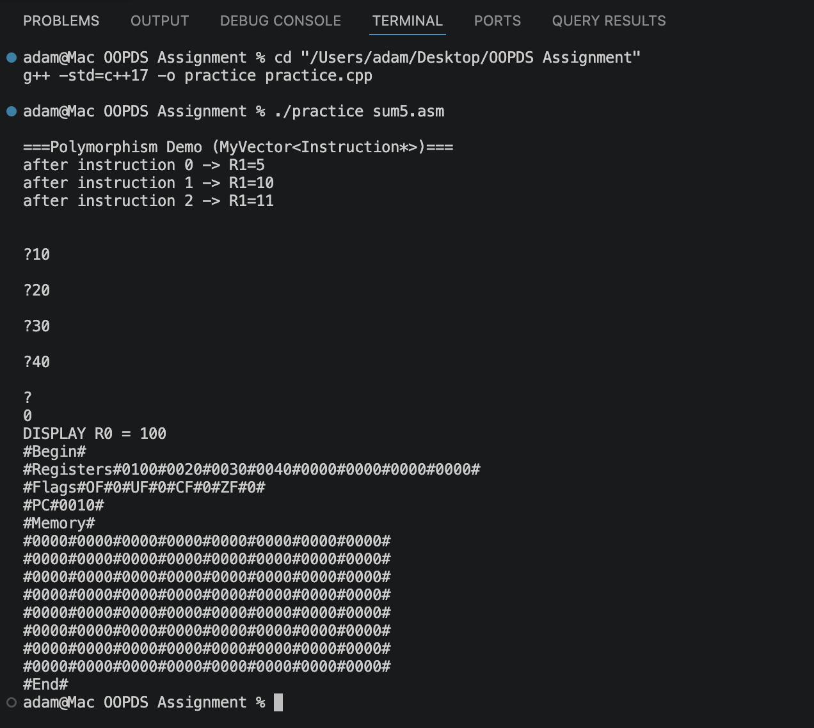

### 4.3 Example Program 2 — Average of 4 Values (`average4.asm`)

```asm
; average4.asm - reads 4 values and displays their average
INPUT R0
INPUT R1
INPUT R2
INPUT R3
ADD R0, R1
ADD R0, R2
ADD R0, R3
MOV R4, 4
DIV R0, R4
DISPLAY R0
```
*Verified:* inputs 10, 20, 30, 40 → R0 = **25**.

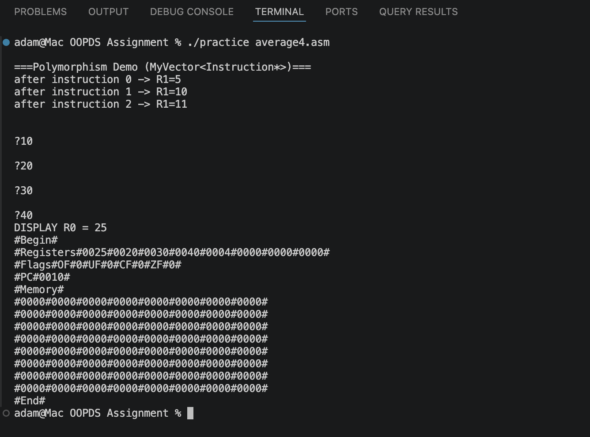

### 4.4 Example Program 3 — Factorial of 4 (`factorial4.asm`)

*(The spec's instruction set has no branch/loop instruction, so for a fixed, small N like 4, the multiplication is unrolled explicitly rather than looped.)*

```asm
; factorial4.asm - calculates 4! = 1*2*3*4 = 24
MOV R0, 1
MOV R1, 2
MUL R0, R1
MOV R1, 3
MUL R0, R1
MOV R1, 4
MUL R0, R1
DISPLAY R0
```
*Verified:* R0 = **24**.

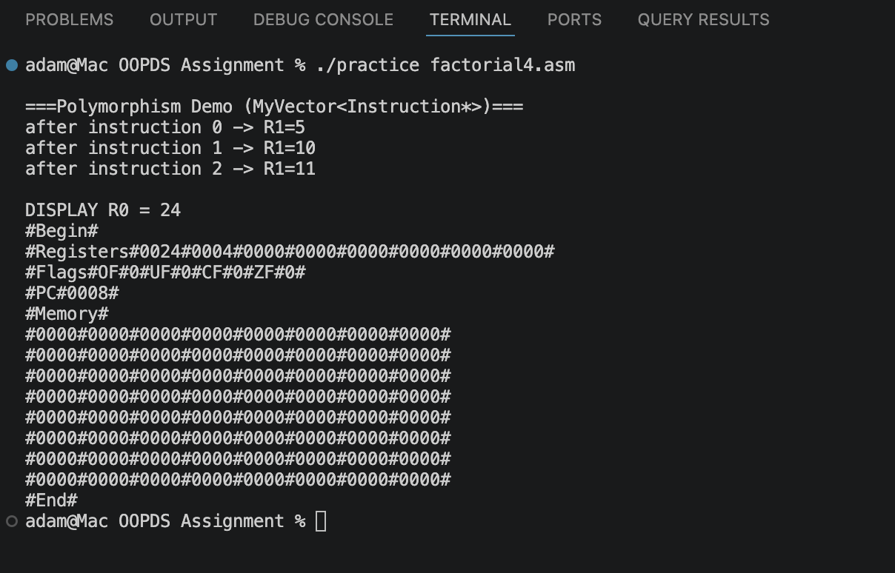

---

## 5. Step-by-Step Runner Demonstration

Trace of **`factorial4.asm`** (`./practice factorial4.asm --step`) — all flags stay 0 throughout since no overflow occurs. R2–R7 are always 0 and omitted. Verified directly from `--step` output:

| Step | Instruction | R0 | R1 | PC |
|------|------------|----|----|-----|
| start | — | 0 | 0 | 0 |
| 1 | `MOV R0, 1` | 1 | 0 | 1 |
| 2 | `MOV R1, 2` | 1 | 2 | 2 |
| 3 | `MUL R0, R1` | 2 | 2 | 3 |
| 4 | `MOV R1, 3` | 2 | 3 | 4 |
| 5 | `MUL R0, R1` | 6 | 3 | 5 |
| 6 | `MOV R1, 4` | 6 | 4 | 6 |
| 7 | `MUL R0, R1` | 24 | 4 | 7 |
| 8 | `DISPLAY R0` (prints 24) | 24 | 4 | 8 |

**Steps 1–3** (command + polymorphism demo + MOV R0,1 / MOV R1,2 / MUL R0,R1):

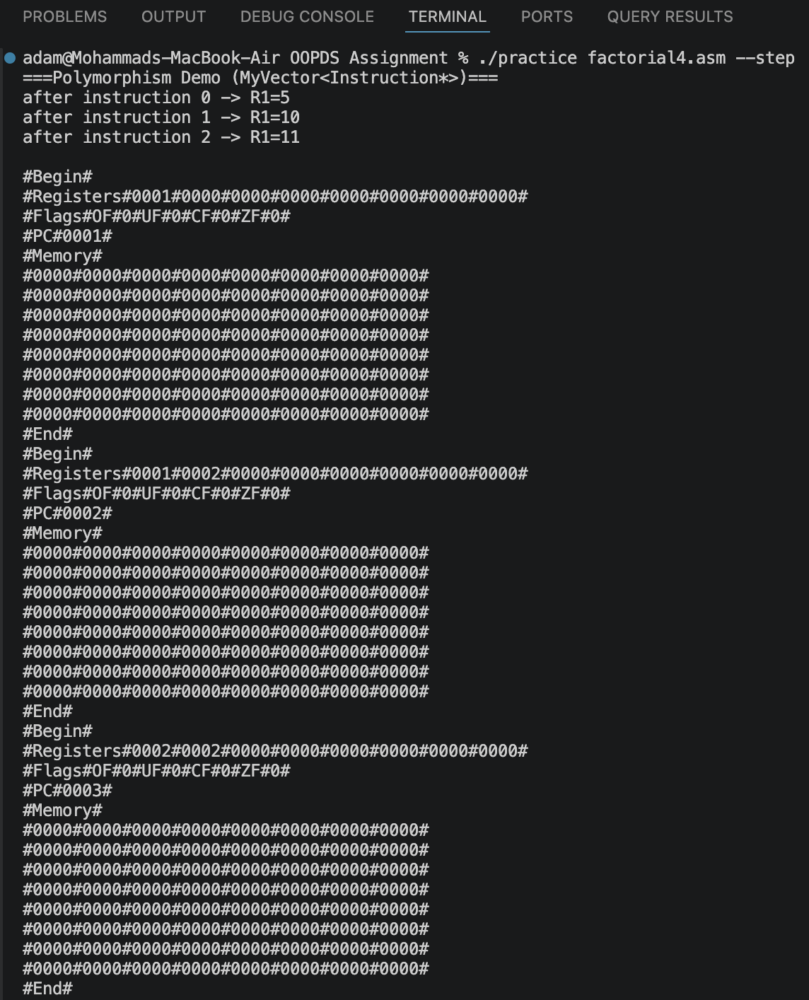

**Steps 4–7** (MOV R1,3 / MUL R0,R1 / MOV R1,4 / MUL R0,R1 → R0=24):

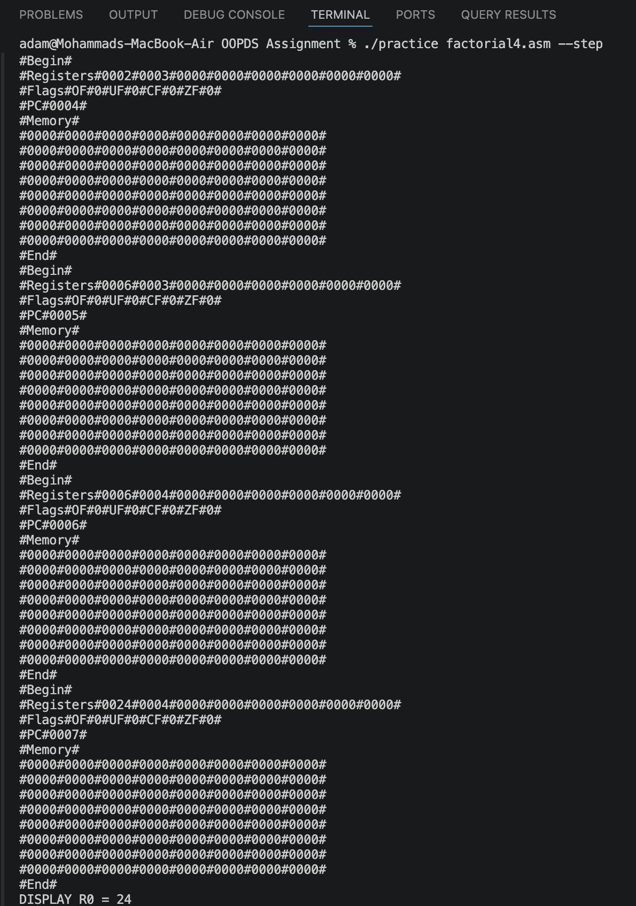

**Step 8** (DISPLAY R0 — final state dump, PC=8):

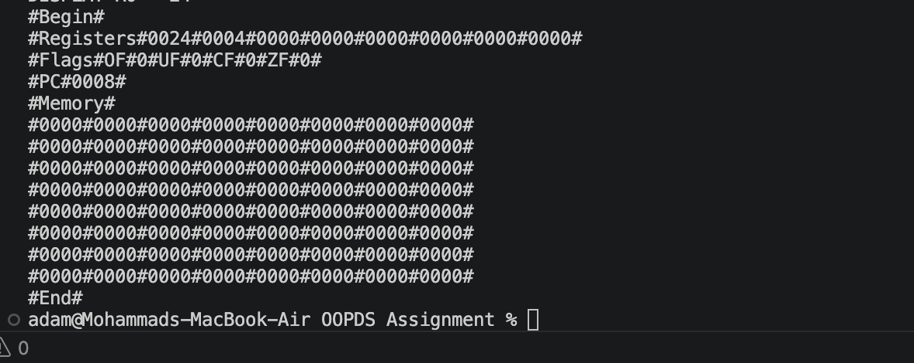

---

## 6. User Manual — Compiling & Running

1. Ensure `g++` (supporting C++17) is installed.
2. Place the source file (`<tutorial>_<group>.cpp`, e.g. `TT9L_I.cpp`) and any `.asm` program files in the same directory.
3. Compile from the command line:
   ```bash
   g++ -std=c++17 -o vm TT9L_I.cpp
   ```
4. Run the compiled program, passing the assembly file as a command-line argument:
   ```bash
   ./vm sum5.asm
   ```
   If no filename is given, it defaults to `test_program.asm` in the current directory. This lets examiners run the program against their own `.asm` files without recompiling.
5. The program prints a polymorphism demo, then the program's `INPUT`/`DISPLAY` output, then the final VM state — written to **both** the screen and `output.txt`:
   ```
   #Begin#
   #Registers#0000#0011#0000#0044#0000#0000#0000#0000#
   #Flags#OF#0#UF#0#CF#0#ZF#0#
   #PC#0006#
   #Memory#
   ...
   #End#
   ```

---

## 7. AI Tool Usage Disclosure

> 📌 **TODO:** confirm this section's wording/placement against the actual policy once confirmed with the course coordinator — this is a reasonable default, not a verified-compliant template.

Claude Code (Anthropic) was used during development to assist with:
- Code review and bug-finding — e.g. identifying that `ROL`/`ROR`/`SHL`/`SHR` corrupted register values by shifting the signed `int` representation instead of the unsigned byte pattern, and that `displayState()` was outputting hexadecimal instead of the decimal format the spec requires.
- Integrating each member's individually-developed classes into the shared `practice.cpp`, including resolving structural gaps against the spec's required class diagram (adding the `ArithmeticInstruction`/`IOInstruction`/`ShiftInstruction` intermediate classes).
- Implementing the `.asm` file parser and `Runner`'s file-loading logic.
- Verifying instruction behavior against the assignment specification PDF, including building and running the spec's own worked example program to confirm output matched byte-for-byte.

All AI-assisted code was reviewed, tested, and is understood by the team before inclusion in this submission.

---

## 8. Conclusion

This assignment provided practical experience applying encapsulation, inheritance, composition, aggregation, and polymorphism to model a working virtual machine, and required implementing custom data structures (`MyVector`, `MyQueue`, `Stack`) rather than relying on STL. The resulting interpreter parses and executes a `.asm` assembly program end-to-end, correctly tracking register, memory, flag, and stack state, and matches the spec's exact output format — verified bit-for-bit against the spec's own worked examples for MOV, ADD, ROL, SHL, and the final state dump.

---

## Outstanding items before this report is submission-ready
- [x] Confirm AI usage disclosure policy with the coordinator and adjust §7 wording/placement accordingly.
- [x] Adeeb's and Ammar's student IDs filled in.
- [x] Tutorial section (TT9L) and group number (I) filled in.
- [x] Class diagram (§2.3) rendered and embedded.
- [x] All 3 activity diagrams (§3.1/§3.2) rendered and embedded.
- [x] Screenshots for §4.2–4.4 captured and embedded.
- [x] Step-by-step screenshots for §5 captured and embedded (factorial4.asm --step, 3 screenshots covering all 8 instructions).
- [ ] Capture a flag-overflow screenshot for §3.2.
- [ ] Convert this Markdown file to PDF and rename to `TT9L_I.pdf`.
- [ ] Record the video (all members explaining their own contribution + live compile/run demo) — see spec §7.3.
